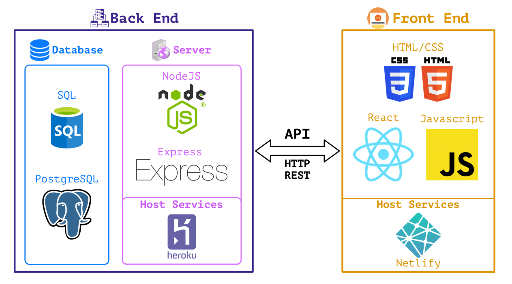

# Talent Path Full-Stack Course Track 6 💻 📚 🎓

**How to use these notes:**
this repository will contain all of the notes for our class.
This README will give a general overview of the entire class, week by week.
You can scan this for a quick reminder of what we did each week.
For more detailed notes, look in the corresponding folder for each week.

## Calendar

| Monday                                                                                                            | Tuesday                                | Wednesday                                                       | Thursday              | Friday            |
| ----------------------------------------------------------------------------------------------------------------- | -------------------------------------- | --------------------------------------------------------------- | --------------------- | ----------------- |
| Intros, HR, IT, Ping Pong challenge                                                                               | Tech overview, machine setup, CLI, Git | coding challenge (introduce yourselves), Kip & Jeff, Happy Hour | Jeff                  | Field Trip        |
| Julie                                                                                                             | Julie                                  | Julie                                                           | **Fourth of July**    | **Fifth of July** |
| Current events, OOP, FP, data structures, documentation, functions, algorithms, pair programming, JS cardio, Jest |                                        |                                                                 |                       |                   |
| Web, stack, Node, API design, agile                                                                               | Express                                | REST                                                            | API design            |                   |
| DB: SQL, architecture                                                                                             |                                        |                                                                 |                       |                   |
| Frontend: Atomic design, HTML, CSS/Sass, design                                                                   | responsive design, flexbox, grid       | JS w/ DOM                                                       |                       |                   |
| React, stateless functional components vs class                                                                   | prop types                             | routing                                                         | Advanced React: hooks | Authentication    |
| Architecture, microservices, CI/CD, testing                                                                       |                                        |                                                                 |                       |                   |

## Project: Forum

- transform MD into HTML
- users
- subreddits/communities
- chat
- message boards
- posts
- customization
- WYSIWYG
- groups
- DATA
- Atomic design
- room to extend

## Global Resources

- [Developer Roadmap](https://github.com/kamranahmedse/developer-roadmap)
- [Front-End Developer Handbook 2018](https://frontendmasters.com/books/front-end-handbook/2018/)
- [w3schools](https://www.w3schools.com/)
- [MDN web docs](https://developer.mozilla.org/en-US/)
- [Odin Project](https://www.theodinproject.com/)
- [JavaScript.info](https://javascript.info/): The Modern Javascript Tutorial
- [hackr.io](https://hackr.io/)
- [State of JavaScript](https://stateofjs.com/)
- Wes Bos
  - [CSS Grid](https://cssgrid.io/)
  - [JavaScript 30](https://javascript30.com/)
  - [What the Flexbox](https://flexbox.io/)
  - [Command Line Power User](https://commandlinepoweruser.com/)
- Podcasts
  - [Syntax](https://syntax.fm/)
  - [ShopTalk](https://shoptalkshow.com/)
  - [99 Percent Invisible](https://99percentinvisible.org/)
- YouTube
  - [Level Up Tuts](https://www.youtube.com/channel/UCyU5wkjgQYGRB0hIHMwm2Sg)
- Blogs
  - [Refactoring UI](https://refactoringui.com/)
  - [Dev Tips](https://umaar.com/dev-tips/)
  - [CSS Tricks](https://css-tricks.com/)
- Forums
  - [Stack Overflow](https://stackoverflow.com/)
  - [Hacker News](https://news.ycombinator.com/news)
- Fun & Inspirational
  - [Codepen](https://codepen.io/)
  - [Dribble](https://dribbble.com/)
- Coding practice
  - [LeetCode](https://leetcode.com/)
  - [HackerRank](https://www.hackerrank.com/dashboard)
  - [Frontloops](https://frontloops.io/): HTML/CSS challenges sent via email
  - [Daily CSS Images](http://dailycssimages.com/)
