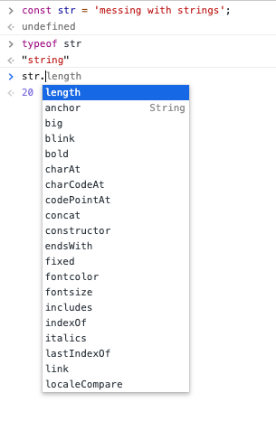
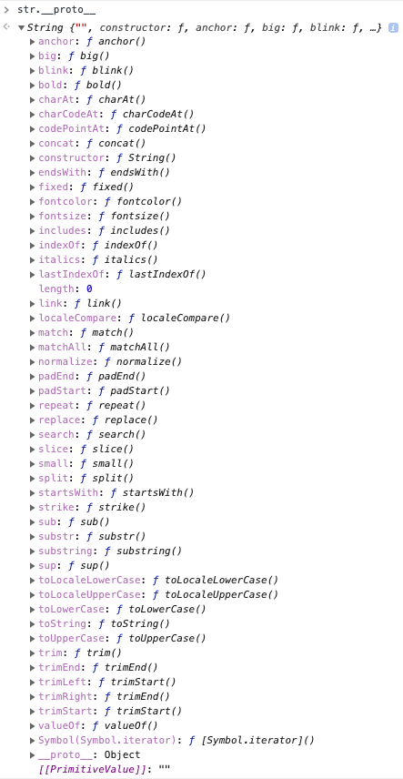

# Week 3: JavaScript

- [Grammar and Good Practices](#Grammar-and-Good-Practices)
- [Types](#Types)
  - [String](#String)
  - [Boolean](#Boolean)
  - [Number](#Number)
  - [null](#null)
  - [undefined](#undefined)
  - [Object](#Object)
  - [Symbol](#Symbol)
  - [BigInt (New)](#BigInt-New)
- [Operations](#Operations)
- [Program Structure](#Program-Structure)
- [Functions](#Functions)
  - [Standard](#Standard)
  - [Arrow](#Arrow)
  - [Higher-order](#Higher-order)
  - [Closures](#Closures)
- [Arrays](#Arrays)
  - [Iterators](#Iterators)
  - [Tuples](#Tuples)
- [OOP (Object Oriented Programming)](#OOP-Object-Oriented-Programming)
  - [Why do we care?](#Why-do-we-care)
  - [Basics: Objects](#Basics-Objects)
  - [The Secret Life of Objects](#The-Secret-Life-of-Objects)
  - [Basics: Prototypes](#Basics-Prototypes)
  - [New-ish: ES6 Classes](#New-ish-ES6-Classes)
  - [Theory of OOP](#Theory-of-OOP)
- [Bugs and Error Handling](#Bugs-and-Error-Handling)
  - [Debugging](#Debugging)
  - [Error Handling](#Error-Handling)
- [ES6 Goodies (Mixed Bag)](#ES6-Goodies-Mixed-Bag)
  - [Variable Identifiers](#Variable-Identifiers)
  - [Spread / Rest Operator](#Spread--Rest-Operator)
  - [Arrow Functions](#Arrow-Functions)
  - [Destructuring](#Destructuring)
- [Modules](#Modules)
- [Asynchronous Programming](#Asynchronous-Programming)
  - [Callbacks](#Callbacks)
  - [Promises](#Promises)
  - [Async/Await](#AsyncAwait)
- [Jest](#Jest)
  - [Unit](#Unit)
  - [Integration](#Integration)
  - [End-to-end (E2E)](#End-to-end-E2E)
- [Project](#Project)
- [Resources](#Resources)

## Grammar and Good Practices

## Types

I sorted these into types that I use frequently. I figured it be useful to study things that might appear more often.

### String

### Boolean

- Properties:
  - true of false

<!-- TODO: Where should we put Truthy and Falsey? -->

### Number

- Properties:
  - 64-bit value
  - Integer or float
  - Positive or negative
  - Special `Number` key words:
    - `Infinity`
    - `-Infinity`
    - `NaN`
- Math Details:
  - Order of operations (PEMDAS) still applies
  - All operations on numbers result in floating-point arithmetic.
    - `/`: Standard division does not truncate decimal values; it maintains floating point precision.
    - `%`: Modulus operator still takes the remainder.
    - Since floating-point rules apply, be careful of high-precision results; you could lose precision.

### null

### undefined

### Object

### Symbol

### BigInt (New)

## Operations

## Program Structure

## Functions

### Standard

### Arrow

### Higher-order

### Closures

## Arrays

### Iterators

### Tuples

## OOP (Object Oriented Programming)

### Why do we care?

JavaScript is full of objects. In fact, you could go so far to say that _EVERYTHING_ in JavaScript is an object.

_If people feel skeptical, tell them to wait for the prototype chain part_

We want to be able to make something that has data and manipulate that data in an organized, scalable, extensible way.

### Basics: Objects

#### Anatomy of an Object

- **Property:** any key / value pair where:
  - Key: must be a string or [Symbol](https://developer.mozilla.org/en-US/docs/Web/JavaScript/Reference/Global_Objects/Symbol)
  - Value: anything

#### Execution

There are a few ways to make raw objects.

```js
const obj1 = {};
const obj2 = Object.create();

//----------Functions-----------------

function MyObject() {
  return {};
}
obj3 = MyObject();

function MyConstructor(name) {
  this.name = name;
}
obj4 = new MyConstructor('bob');
```

Teaching Instructions:

- Start attaching things to the object and showing how JavaScript is a dynamic language.
- Show that variables and functions being values in a property.

### The Secret Life of Objects

TODO: Figure out what this is...

### Basics: Prototypes

How do we know what an object should do? How are we supposed to interact with these various things that are floating around our program?

Traditionally,

When you make a string:

```js
const str = 'hello';
```

Teaching instructions:

- Dive into the object
- Take a look at the \_proto\_ chain of each of these things and explain that everything has attached functionality, because everything is an object.
- Add a method to the prototype chain and make multiple objects from it.

That string variable `str` gets converted into the JavaScript equivalent of the `String` class. Each of those strings have available methods (modifiers of class data) to use.



And this is what it looks like when you investigate the String \_proto\_ that is attached to every String object.



### New-ish: ES6 Classes

A stylistic wrapper to make OOP easier to use is `class` syntax. A class is a template that can be used to construct objects. If you are more familiar with C-based languages, this will feel right at home.

```js
class Pet {
  constructor(name) {
    this.name = name;
  }
}

const dog = new Pet('Max');
```

We are not just limited to data as well; we can supply methods to manipulate said data.

```js
class Pet {
  static isDog(animal) {
    return Object.getPrototypeOf(animal).constructor.name === this.name;
  }

  constructor(name) {
    this.name = name;
  }

  doTrick(trick) {
    console.log(`I can ${trick}. Watch this!`);
  }
}
```

Methods can be added to classes:

- `doTrick(trick)` is a method specific to the object instance. In other words, it is used to manipulate data that could be changed among objects of the same class.
- `isDog(animal)` is a static method. Static methods are like prototypes where they can be shared among objects and their effects are the same.

```js
class Pet {
  constructor(name) {
    this.name = name;
  }

  doTrick(trick) {
    console.log(`I can ${trick}. Watch this!`);
  }
}

class Dog extends Pet {
  constructor(name) {
    super(name);
  }

  sit() {
    console.log(`I am sitting`);
  }
}

const myDog = new Dog('Mike');
myDog.doTrick('jump');

// Output: I can jump. Watch this!
```

Inheritance can also be used with the `extends` key word. Classes the inherit must use the `super` keyword to pass data to the parent's constructor to initialize data.

### Theory of OOP

Four pillars of OOP:

- Abstraction
- Encapsulation
- Inheritance
- Polymorphism

#### Abstraction

In computers we never make the things we represent; we make abstractions of those concepts. OOP can represent real-life objects like animals, cars, people. However, it can also represent a process or idea. Not everything needs to be real, but objects can create structure for it, nonetheless.

#### Encapsulation

Do you want data to be relevant to the object? Do you want methods to manipulate that data?

Encapsulation gives you a space that is separated from the outside environment (in loose terms).

#### Inheritance

I have something that is strongly related to another thing. Maybe they have some sort of relationship or share data / functionality

Inheritance allows you to build relationships between objects so that you do not have to rewrite code in those objects.

Ex: Everything in JS is an object. The `String` class **inherits** from the `Object` class to get some basic methods.

**WARNING** Inheritance can be dangerous if too vertical relationships are made. Changes in the base class ripple down through all child classes.

#### Polymorphism

More advanced, can be covered later.

## Bugs and Error Handling

### Debugging

### Error Handling

#### Try / Catch

When you have a block of code that could be prone to errors / bugs, you might want to wrap it in a `try {}` block. However, every `try` block should have a proceeding `catch() {}` block along with it

```js
const getUserData (database) {
  try {
    const data = database.find('user');
  } catch (err) {
    console.log(err);
  }
}
```

If the code within the `try` block fails:

- It immediately generates an `Error` object that breaks the normal programming flow.
- This object will travel up the call stack until something resolves the error or the program crashes.

The first thing that could resolve the error is the `Catch` block. In the code snippet above, `err` is the `Error` object that was generated when `database.find('user')` failed. All we do with the error is resolve it by logging it to the console. Since I don't know what to do with the error right now, logging it is the best I can do.

#### Throw

Continuing our example from above, a better solution to handling an error we don't know what to do with is to `throw` the error.

```js
const getUserData (database) {
  try {
    const data = database.find('user');
  } catch (err) {
    console.log(err);
    throw err; // DEV: Now I added a throw expression.
  }
}
```

Now, my error handling allows whatever called `getUserData()` to deal with the error and logs the issue where it happened (better for debugging).

**Just be careful!** If you never resolve the problem and continue to throw the error, your program will crash.

#### Finally (new to JS)

Continuing our example from above... If I had something that **MUST** be done after my `try` and `catch` blocks, it can be done in a `finally` block.

```js
const getUserData (database) {
  try {
    const data = database.find('user');
  } catch (err) {
    console.log(err);
    throw err;
  } finally {
    console.log('Database operations: Finished'); // DEV: log when done.
  }
}
```

Now, in my `finally` block, I log when this function completes **NO MATTER WHAT**.

If the `try` block is:

- Successful: `try -> finally`
- Unsuccessful: `try -> catch -> finally`

**Just be careful!** If you have code that fails in the finally, there is no `catch` block to save you.

## ES6 Goodies (Mixed Bag)

### Variable Identifiers

#### Let

#### Const

#### Var

### Spread / Rest Operator

### Arrow Functions

Covered in detail under the [Functions Section]()

### Destructuring

## Modules

## Asynchronous Programming

### Callbacks

### Promises

### Async/Await

## Jest

### Unit

### Integration

### End-to-end (E2E)

## Project

- data manipulation
- makeshift server

## Resources

- JS Basics:
  - [EloquentJS - Values](https://eloquentjavascript.net/01_values.html)
  - [MDN - Grammar and Types](https://developer.mozilla.org/en-US/docs/Web/JavaScript/Guide/Grammar_and_Types)
  - [MDN - Expressions and Operators](https://developer.mozilla.org/en-US/docs/Web/JavaScript/Guide/Expressions_and_Operators)
- [Object Basics](https://developer.mozilla.org/en-US/docs/Learn/JavaScript/Objects/Basics)
- [Prototypes](https://developer.mozilla.org/en-US/docs/Learn/JavaScript/Objects/Object_prototypes)
- [Classes](https://www.javascriptjanuary.com/blog/es6-classes)
- [Pillars of OOP](https://www.quora.com/What-are-the-4-pillars-of-OOPs)
- [ES6 Classes](https://www.javascriptjanuary.com/blog/es6-classes)
